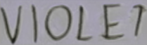
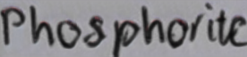
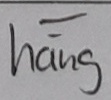
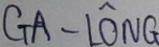
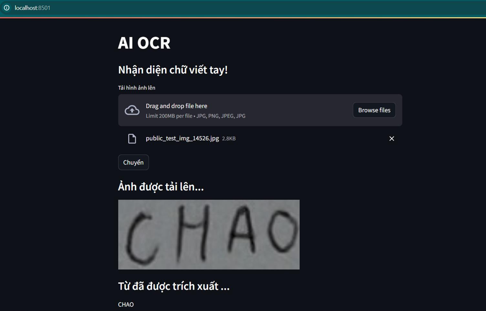

# Vietnamese Handwritten Text Recognition

_SoICT Hackathon 2023 - Vietnamese Handwritten Text Recognition 🏃‍♂️‍➡️_

_One love, one future ❤️_

Team name: **TS1-AI**

## Introduction

**Vietnamese Handwritten Text Recognition (HTR)** is a challenging yet crucial task in the field of computer vision. The goal is to accurately convert handwritten text images into machine-readable text. However, the diversity of handwriting styles.

In recent years, deep learning-based approaches have demonstrated remarkable performance. Nevertheless, building a robust Vietnamese HTR system remains a complex problem due to the unique characteristics of the Vietnamese language.

This project aims to develop a deep learning model, bidirectional stacked LSTM using CNN features as input with CTC loss to perform robust word recognition. We conducted extensive experiments on a large-scale Vietnamese handwritten text dataset to evaluate the performance of our model.

## Dataset Preparation

Vietnamese Handwritten Text Dataset HomePage: [Dataset](https://aihub.ml/competitions/426)

- **Training data:** This is a real-world dataset with labels, used to train the model. It consists of 103,000 images (including 51,000 form images, 48,000 wild images, and 4,000 GAN-generated images).
- **Public test:** This is an unlabeled dataset used for preliminary evaluation. It consists of 33,000 images (including 17,000 form images and 16,000 wild images).

**Data sample:**

|                                                |                                                |
| ---------------------------------------------- | ---------------------------------------------- |
|   |   |
|  |  |

**Evaluation metric:** The evaluation metric is CER, which represents the percentage of characters in the label file text that are incorrectly predicted. The lower the CER, the more accurate the recognition model.

$$ CER = \frac{S+D+I}{N} $$

- S (substitutions): Number of characters that need to be replaced to transform the prediction into the ground truth.
- D (deletions): Number of characters that need to be deleted to transform the prediction into the ground truth.
- I (insertions): Number of characters that need to be inserted to transform the prediction into the ground truth.
- N: Number of characters in the word.

## Data Preprocessing

Image convert to **grayscale color**, resized image to `(HEIGHT, WIDTH) = (32,100)`.

## Model

The model as built is a hybrid of Shi et al.'s CRNN architecture ([arXiv:1507.0571](https://arxiv.org/abs/1507.05717)) and the VGG deep convnet, which reduces the number of parameters by stacking pairs of small 3x3 kernels. In addition, the pooling is also limited in the horizontal direction to preserve resolution for character recognition. There must be at least one horizontal element per character.

Starts with  $32 \times 100$ image, the dimensions at each level of filtering are as follows:

| Layer | Op   | KrnSz | Stride(v,h) | OutDim | H   | W   | PadOpt |
| :---: | ---- | ----- | :---------: | ------ | --- | --- | ------ |
|   1   | Conv | 3     |      1      | 64     | 30  | 98  | valid  |
|   2   | Conv | 3     |      1      | 64     | 30  | 98  | same   |
|       | Pool | 2     |      2      | 64     | 15  | 49  |
|   3   | Conv | 3     |      1      | 128    | 15  | 49  | same   |
|   4   | Conv | 3     |      1      | 128    | 15  | 49  | same   |
|       | Pool | 2     |     2,1     | 128    | 7   | 48  |
|   5   | Conv | 3     |      1      | 256    | 7   | 48  | same   |
|   6   | Conv | 3     |      1      | 256    | 7   | 48  | same   |
|       | Pool | 2     |     2,1     | 256    | 3   | 47  |
|   7   | Conv | 3     |      1      | 512    | 3   | 47  | same   |
|   8   | Conv | 3     |      1      | 512    | 3   | 47  | same   |
|       | Pool | 3     |     3,1     | 512    | 1   | 45  |
|   9   | LSTM |       |             | 512    |     |     |
|  10   | LSTM |       |             | 512    |     |     |

## Result

Proposed model is evaluated on the Vietnamese Handwritten Text Dataset, obtained a CER of **7.91%**.


## Running on docker

### 1. Training model

```
docker build -t ocr_train .

docker run --name ocr_train ocr_train
```

### 2. Predict

Open terminal on docker

```
python './src/predict.py'
```

The result are saved to file `'/app/'prediction.txt`

### Web demo

- Download library and model checkpoint:

```bash
pip install -r requirements.txt
```


- Run following command and access `http://localhost:8501/` to demo:

```
streamlit run run.py
```




## Dataset and checkpoints

---------- Update ----------


## Future work

- Implement paper Robust Scene Text Recognition with Automatic Rectification ([RARE](https://arxiv.org/abs/1603.03915)) to address irregular text. RARE is a specially designed deep neural network, which consists of a Spatial Transformer Network (STN) and a Sequence Recognition Network (SRN).

- Try SOTA model like **Vision Transformer** (ViT), **Swin Transformer**,...
